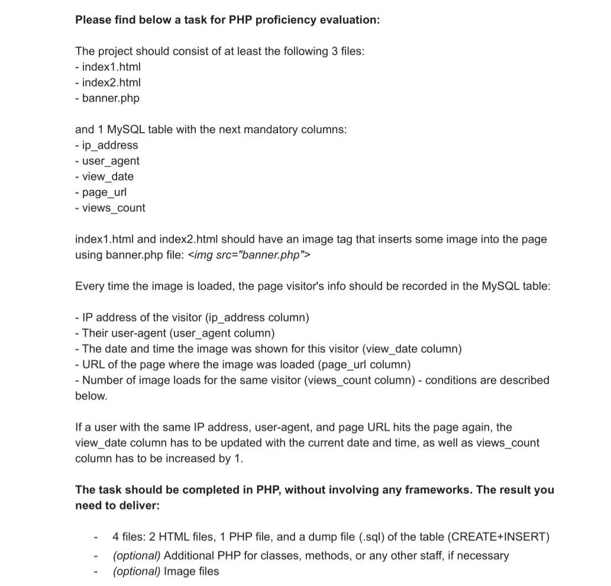

# --- SET UP PROJECT ---

#### 1.  make virtual host for project in order to see result correctly
```text
Bellow is example for Ubuntu
```
For more details see [topic](https://www.digitalocean.com/community/tutorials/how-to-set-up-nginx-server-blocks-virtual-hosts-on-ubuntu-16-04)

```nginx

server {
       listen 80;

       root /home/marine/testTasks/visitCounts;
       server_name visits.lc;
       error_log /var/log/nginx/visitCounts.lc.error.log;

       client_max_body_size 50m;

        location / {
          try_files $uri $uri/index1.html;
        }
       
       error_page 404 /index1.html;

       location ~ \.php$ {
           try_files $uri =404;
           fastcgi_split_path_info ^(.+\.php)(/.+)$;
           fastcgi_pass unix:/run/php/php7.4-fpm.sock;
           fastcgi_index index.php;
           fastcgi_param SCRIPT_FILENAME $document_root$fastcgi_script_name;
           fastcgi_connect_timeout 300s;
           fastcgi_read_timeout 300s;
#          fastcgi_proxy_read_timeout 300s;
           include fastcgi_params;
       }
}
```

```hosts
127.0.0.1 visits.loc
```

#### 2. set up  db configs
###### 2. 1 see config/dn.php  change according your db
###### 2. 2 run  into mysql console  at least dbDump/create.sql file in order to have DB structure

#### 2. Open one of html files and test !


### Hope I can help with guide.
#### Author: Marine
#### Email: marine.gasparyan.96@gmail.com

#### Test task:
